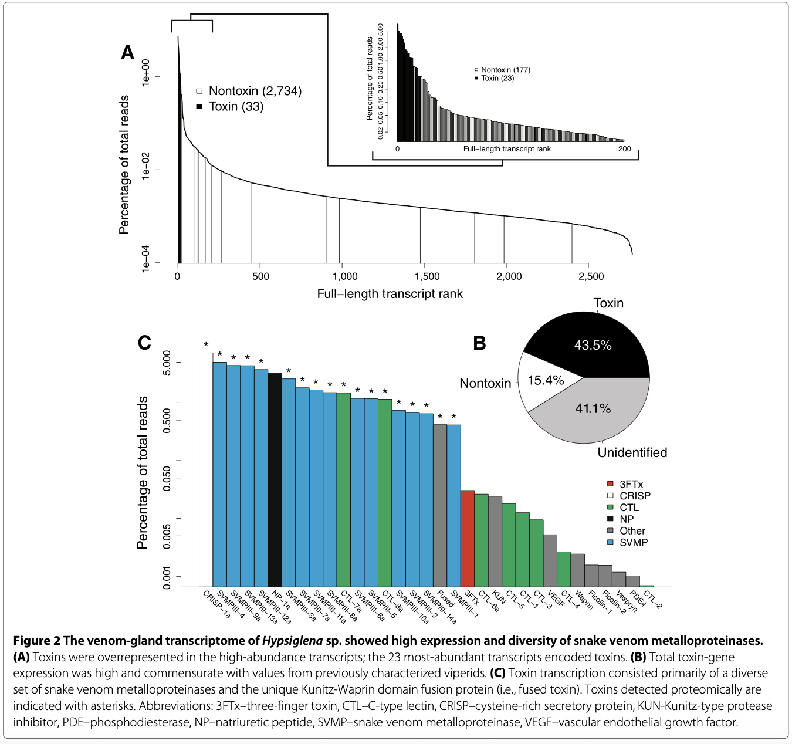

# Venom-gland transcriptome for king cobra ***Ophiophagus hannah***

We are looking to recreate a figure in the style of Figure 2 from the Rokyta et al 2014 paper (DOI: 10.1186/1471-2164-15-1061) analyzing the snake venom-gland transcriptome. The venoms of front-fanged snakes (families Viperidae and Elapidae) have been extensively characterized, likely because of their noxious character; rear-fanged snakes’ venom (family Colubridae), alternatively, are comparatively understudied. Within this paper, the authors performed RNA sequencing on a specimen of genus Hypsiglena and Boiga irregularis, reporting on the expression levels and variety of snake-venom specific transcripts. As they performed de novo transcriptome analysis, we are not looking to exactly recreate their figures but rather generate a novel figure highlighting the venom transcripts of a more highly characterized snake: front-fanged king cobra Ophiophagus hannah. King cobra (family Elapidae) sequencing data is publicly available through the NCBI Sequence Read Archive as FASTA files to be downloaded (accession numbers: Bio-Project GCA_000516915.1 for whole genome sequencing and SRP055563 for transcriptome). Figure 2 focuses on the data from Hypsiglena, showing high expression and diversity of venom metalloproteins; our figure similarly looks to emphasize metalloprotein content, as well as high venom transcript expressivity and diversity. Comparisons into front-fanged vs rear-fanged snake transcriptome can provide insights into their differing ecological niche’s and impacts as higher-order predatory species; research into Ophiophagus in particular may contribute to anti-venom and drug development. 
We are hoping that this re-organization of our project will allow for sequence alignment of an existing genome, to support downstream annotation, identification, and analysis of venom transcripts. \

If needed, a reference transcriptome could be used from the black mamba, Dendroaspsis polylepis; king cobra and black mamba are both species within Elapidae, Ophiophagus and Dendroaspsis are sister clades. Black mamba  transcriptome data are also available through the NCBI SRA under accession number: SRR5485228.   

Reference figure from Rokyta et al 2014:

Figure 2: The venom-gland transcriptome of Hypsiglena sp. showed high expression and diversity of snake venom metalloproteinases.

## Datasets: 
***O. hannah***\
Whole genome sequencing: Bio-Project GCA_000516915.1\
https://www.ncbi.nlm.nih.gov/datasets/genome/GCA_000516915.1/ 

Transcriptome: SRA SRP055563\
https://trace.ncbi.nlm.nih.gov/Traces/?view=run_browser&acc=SRR1821260&display=metadata 

***D. polylepis***\
Transcriptome: SRA SRR5485228\
https://trace.ncbi.nlm.nih.gov/Traces/?view=run_browser&acc=SRR5485228&display=metadata 

## Software: (would like help with this pls)
**FastQC 0.12.1:** Run a quality control check on sequencing data;   
https://anaconda.org/bioconda/fastqc   

**Skewer:** Trim sequence adapters if needed.   
https://sourceforge.net/projects/skewer/  

**Bowtie2 sequence aligner version 2.5.4**  
https://bowtie-bio.sourceforge.net/bowtie2/index.shtml  

- Alternatively, we could use a splice-aware aligner. E.g. Star or HISAT2 to index and align to the reference genome.   
- **HISAT 2.2.1:** 
https://daehwankimlab.github.io/hisat2/  

**FeatureCounts/Subreads version 2.1.1:** Count how many reads align to a gene within the reference genome.   
https://subread.sourceforge.net/   

## Goals:
1. Assemble and align king cobra sequences along genome\
2. Identify coding vs non-coding transcripts   
3. Identify toxin-specific (i.e. metalloproteins) and non-toxin specific transcripts in transcriptome via comparisons to blastx protein searches  
4. Quantify transcript abundances, protein categories, expression levels

Reach goal!  

5. Found Colubridae reference genome (WGS *Pantherophis guttatus* SRA accession #: SRR32257721), would like to use same pipeline from king cobra figure to recreate figure 2 for rear-fanged snakes and compare!!
